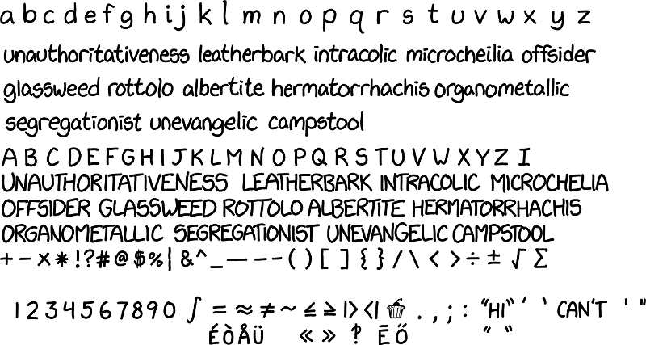

Title: Classifying segmented strokes as characters - Part 3 of an XKCD font saga
Date: 2017-04-01
Category: field-notes
Tags: XKCD, fonts, Python
Slug: xkcd_font_classifying_strokes
Author: Phil Elson

In [part two]({filename}/field_notes/xkcd_font_pt2.md) of my XKCD font saga I was able to separate strokes from the XKCD
handwriting dataset into many smaller images. I also handled the easier cases of merging some of the strokes back together - I particularly
focussed on "dotty" or "liney" type glyphs, such as i, !, % and =.

Now I want to attribute a Unicode character to my segmented images, so that I can subsequently generate a font-file. 
We are well and truly in the domain of optical character recognition (OCR) here, but because I want absolute control of the results
(and 100% accuracy) I'm going to take the simple approach of mapping glyph positions to characters myself.

<!-- PELICAN_END_SUMMARY -->

If you'd like to follow along, the input files for this article may be found at [https://gist.github.com/pelson/b80e3b3ab9edbda9ac4304f742cf292b](https://gist.github.com/pelson/b80e3b3ab9edbda9ac4304f742cf292b), the notebook and output may be found [https://gist.github.com/pelson/1d6460289f06acabb650797b88c15ae0](https://gist.github.com/pelson/1d6460289f06acabb650797b88c15ae0).

As a reminder, here is a downsampled version the XKCD handwriting file:



## Conclusion

In this edition, I merged the few remaining strokes together to produce the finished glyphs, and classified each of the glyphs with associated
characters (mostly unicode). I then saved these rasters out to a semantic filename in the PPM format. Next up, convert the rasters to vector SVGs
so that we can import them into our font tool programmatically.

*The next article in this series is*: **[Converting PPM to SVG, and creating a font with FontForge]({filename}/field_notes/xkcd_font_pt4.md)**.
